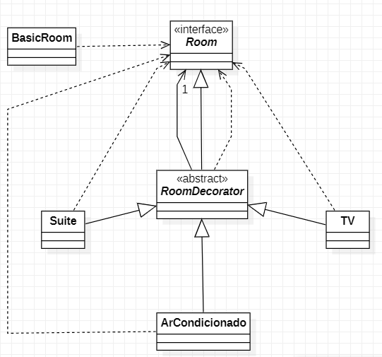

# Padrões de Projeto

## 2. Padrões de Estruturais:
___
### 2.1 Decorator

#### 2.1.1 Introdução
Tratas-se de uma alteranativa para craição de subclasses para estender funcionalidades. A intenção é anexar dinamicamente responsabilidades adicionais flexíveis a um objeto.

#### Vantagens →

- Aprimora a extensibilidade do objeto, pois as alterações são feitas codificando novas classes;
- Simplifica o desenvolvimento permitindo uma série de classes com funcionalidades específicas, ao invés de codificar todo o comportamento no objeto ;

#### 2.1.2 Exemplo abordado

Como exemplo para este padrão abordei o tema de quarto de hotel, onde podemos adicionar novos elementos a ele, como Ar condicionado, uma suíte, etc.
#### 1.1.3 Diagrama de Classe do Exemplo

